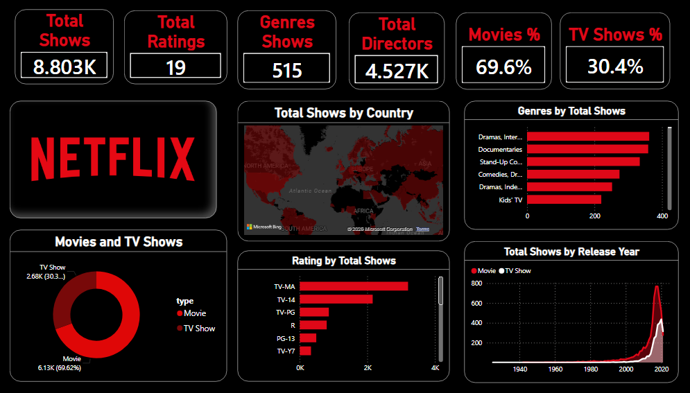

# Netflix Content Analysis Dashboard

## Overview

This project combines Python-based Exploratory Data Analysis (EDA) and Power BI visualization to analyze Netflix content. Python was used for data exploration and understanding content trends, while Power BI was used to build an interactive dashboard for data storytelling and business insights.

## Dashboard Preview

## Project Workflow

Netflix Dataset → Python Analysis → Data Exploration → Power BI Dashboard → Business Insights

## Key Metrics

* Total Shows: 8,803
* Total Ratings: 19
* Total Genres: 515
* Total Directors: 4,527
* Movies Percentage: 69.6%
* TV Shows Percentage: 30.4%

## Dashboard Features

* KPI Cards
* Rating Analysis
* Genre Analysis
* Country-wise Content Distribution
* Movies vs TV Shows Analysis
* Release Year Trend Analysis

## Key Insights

* Movies account for approximately 69.6% of Netflix content.
* TV Shows account for approximately 30.4% of Netflix content.
* TV-MA is the most common content rating.
* Drama and Documentary genres are the most popular categories.
* Netflix content releases increased significantly after 2015.
* Content production is concentrated in a few major countries.

## Tools & Technologies

* Python
* Pandas
* NumPy
* Matplotlib
* Seaborn
* Power BI
* DAX

## Project Structure

Netflix-Data-Analysis

├── dataset

├── images

│   └── netflix_dashboard.png

├── reports

│   └── Netflix_Dashboard.pbix

└── README.md

## Author

Pavani Yeddala

Data Analytics Enthusiast
